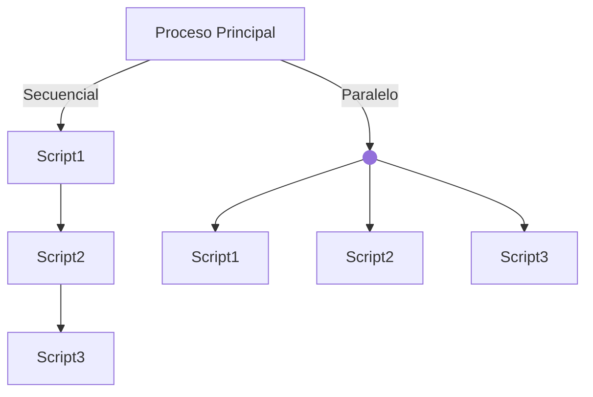

¿QUÉ HACE PROCESS SIMULATOR?

Lanza 3 scripts Java (Script1, Script2, Script3).

Mide el tiempo de ejecución de forma:

    Secuencial → un proceso tras otro.

    Paralela → todos los procesos a la vez.

    Guardamos resultados en un log.

DIFERENCIAS ENTRE PROCESO E HILO 

Característica         | Proceso                           | Hilo 
-----------------------|-----------------------------------|-----------------------------------
Unidad de ejecución    | Programa independiente            | Subtarea dentro de un proceso
Memoria                | Propia y aislada                  | Comparte memoria con otros hilos
Coste de creación      | Alto (pesado de crear)            | Bajo (ligero de crear)
Aislamiento            | Seguro: fallo no afecta a otros   | Inseguro: fallo afecta al proceso
Comunicación           | Compleja (pipes, sockets, ficheros)| Sencilla (variables compartidas)
Uso típico             | Ejecutar apps externas, aislamiento| Concurrencia dentro de la app

==============================================================

Daniel R.
