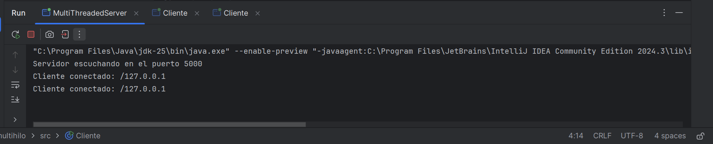
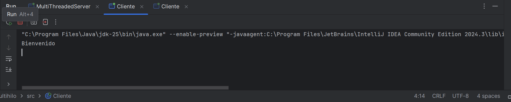

Servidor multicliente con hilos:

El servidor acepta conexiones simultáneas mediante Thread por cliente.
Mensajes implementados: Bienvenido, eco de mensajes y Hasta luego al enviar "salir".
Pruebas realizadas con dos clientes desde terminal y clase Cliente.java.

Ejecución:
1. Ejecutar MultiThreadedServer.
2. Abrir dos terminales y ejecutar Cliente.java en función de cuantos clientes queramos.

## Pruebas

