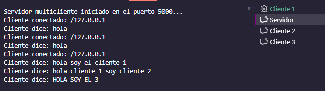

# Servidor Multicliente con Hilos

## Descripción

Este proyecto implementa un servidor TCP capaz de manejar múltiples
clientes simultáneamente mediante el uso de **hilos**. Cada cliente que
se conecta es gestionado por un hilo independiente, lo que permite
varias conexiones concurrentes.

------------------------------------------------------------------------

## Estructura del proyecto

    /multihilo
     ├── ClienteSimple
     ├── ProcesadorClientes
     └── ServidorMultiThread


------------------------------------------------------------------------

## Ejecución

### Iniciar el servidor

``` bash
java server.ServidorMultiThread
```

### Iniciar uno o varios clientes

``` bash
java client.ClienteSimple
```

------------------------------------------------------------------------

## ✉️ Comandos soportados

  Cliente envía      Servidor responde
  ------------------ -----------------------
  texto cualquiera   Eco: `<texto>`{=html}
  bye                Hasta luego.

------------------------------------------------------------------------

## Captura



------------------------------------------------------------------------

Daniel Ronda
