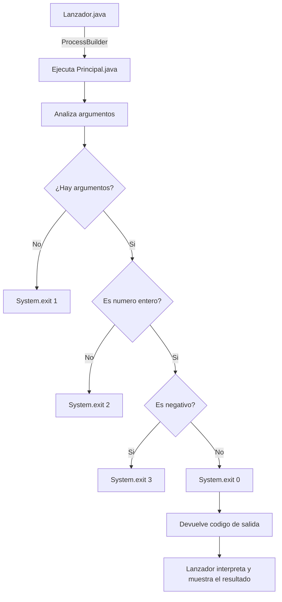

# TAREA3 - Programación de Procesos en Java (II)

Este proyecto contiene dos clases principales en Java:

- **Principal.java**  
  Programa que recibe argumentos desde `main()` y devuelve distintos códigos de salida con `System.exit()` según las condiciones especificadas.  
- **Lanzador.java**  
  Ejecuta el programa `Principal` como subproceso mediante `ProcessBuilder` e interpreta el código de salida mostrado por el proceso hijo.

---

```
TAREA3/
├── src/
│ ├── Principal.java
│ └── Lanzador.java
└── README.md

```

---

## Funcionamiento

### `Principal.java`
- Recibe argumentos desde la línea de comandos.  
- Devuelve los siguientes códigos de salida:
  - `1` → Si no se proporcionan argumentos.  
  - `2` → Si el argumento no es un número entero (es una cadena).  
  - `3` → Si el argumento es un número entero negativo.  
  - `0` → En cualquier otro caso (número válido y no negativo).  
- Usa `System.exit(<código>)` para devolver el resultado al sistema.

### `Lanzador.java`
- Ejecuta `Principal` con **ProcessBuilder** (`java Principal <argumento>`).  
- Usa `pb.inheritIO()` para compartir la entrada/salida con la consola actual.  
- Espera a que el proceso hijo termine y obtiene su **código de salida** con `waitFor()`.  
- Muestra en pantalla un mensaje interpretando el valor devuelto:
  - `0` → Ejecución correcta.  
  - `1` → Sin argumentos.  
  - `2` → Argumento no numérico.  
  - `3` → Número negativo.  
  - Otro → Error desconocido.

---



---

Daniel Ronda
