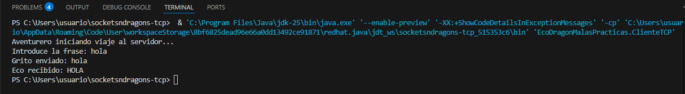

# Sockets & Dragons

[Enlace al vídeo de Youtube](https://www.youtube.com/watch?v=fw8dQIEuRfs)

# Descripción general del proyecto

Este proyecto se centra exclusivamente en las misiones TCP e implementa distintas misiones basadas en comunicación cliente–servidor usando TCP, inspiradas en el ejercicio propuesto en el vídeo de referencia. El objetivo principal es comprender el funcionamiento de los sockets TCP, aplicar buenas prácticas, identificar malas prácticas reales y demostrar la robustez del servidor ante fallos y ataques.

# Misión: La Guarida del Dragón (TCP)

### Carpeta: [`EcoDragon`](./EcoDragon)

- Cliente TCP que envía un mensaje de texto al servidor.
- Servidor TCP que recibe el mensaje, lo transforma íntegramente a MAYÚSCULAS y lo devuelve.
- Comunicación fiable usando `Socket` y `ServerSocket`.
- Implementación multicliente concurrente mediante hilos.
- Control de errores y desconexiones abruptas.
- Uso de semáforo para limitar el número real de clientes simultáneos.
- Expulsión automática de clientes inactivos mediante timeout.

## Evidencias del funcionamiento:

**Prueba Cliente EcoDragon**

**Prueba Servidor EcoDragon**

# Variante educativa: Malas prácticas TCP

### Carpeta: [`EcoDragonMalasPracticas`](./EcoDragonMalasPracticas)

Aquí se documenta de forma intencionada qué **NO** debe hacerse en un servidor TCP real:

- Sin límite de clientes concurrentes.
- Sin timeout de conexión.
- Creación ilimitada de hilos.
- Gestión deficiente de recursos.
- Falta de validación de entradas.

El objetivo es permitir al Cazador de Bugs provocar fallos reales y comparar el comportamiento con la versión robusta del servidor.

## Evidencias del funcionamiento:

**Malas prácticas: Prueba Cliente EcoDragon**

**Malas prácticas: Prueba Servidor EcoDragon**

_Esta implementación tiene únicamente fines educativos._

# Misión: El Oráculo (TCP)

### Carpeta: [`Oraculo`](./Oraculo)

- Cliente TCP que envía un número entero al servidor.
- Servidor TCP que calcula el cuadrado y el cubo del número recibido.
- Respuesta devuelta al cliente mediante TCP.
- Control de concurrencia con semáforo.
- Timeout para clientes inactivos.

## Evidencias del funcionamiento:

**Prueba Cliente Oráculo**

**Prueba Servidor Oráculo**

# Pruebas de estrés y robustez (Cazador de Bugs)

### Carpeta: [`tests`](./tests)

El proyecto incluye pruebas específicas para demostrar la resiliencia del servidor TCP ante situaciones adversas:

- `TestConexionesMultiples.java`.
  Simula miles de conexiones simultáneas para comprobar el límite real de clientes y evitar ataques de denegación de servicio (DoS).
- `TestdeVacio.java`.
  Cliente que se conecta y no envía datos, verificando la correcta expulsión por timeout.
- `TestMensajePesado.java`.
  Envío de una carga útil de gran tamaño (≈50 MB) para comprobar el comportamiento del servidor ante mensajes excesivos.

Estas pruebas se utilizan durante la demo final para demostrar que el servidor no colapsa y se recupera correctamente.

# Arquitectura Cliente-Servidor TCP

La arquitectura sigue un modelo cliente–servidor clásico:

1. El cliente inicia la conexión TCP.
2. El servidor acepta la conexión y crea los streams.
3. El cliente envía datos.
4. El servidor procesa la información.
5. El servidor devuelve la respuesta.
6. Ambos extremos cierran la conexión de forma ordenada.

El uso de TCP garantiza fiabilidad, orden y entrega completa de los mensajes.

**_Figura 1_**. Diagrama de secuencia de la arquitectura Cliente–Servidor TCP (Eco del Dragón). El cliente establece una conexión TCP, envía un mensaje de texto al servidor, el servidor lo transforma a mayúsculas y devuelve el eco antes de cerrar la conexión de forma ordenada.

## Descripción de la arquitectura

La arquitectura implementada sigue un modelo cliente-servidor clásico basado en TCP, donde el servidor actúa como un punto central de escucha y el cliente como iniciador de la comunicación.
El servidor utiliza un `ServerSocket` para permanecer a la espera de conexiones entrantes, mientras que el cliente establece la conexión mediante un `Socket`.

Una vez aceptada la conexión (`accept()`), se crea un canal de comunicación bidireccional fiable. El cliente envía un mensaje de texto utilizando un stream de datos (`writeUTF`), que el servidor recibe de forma íntegra y sin pérdidas gracias a las garantías del protocolo TCP.

## Ventajas de la arquitectura

Esta arquitectura es adecuada y sólida por varios motivos:

- **Fiabilidad**: Al usar TCP, se asegura que el mensaje llega completo, en orden y sin duplicados, lo cual es esencial para este tipo de comunicación.
- **Separación de responsabilidades**:
  - El cliente se limita a enviar datos y mostrar resultados.
  - El servidor se encarga exclusivamente del procesamiento y la respuesta.
- **Escalabilidad básica**: El uso de un bucle de aceptación de clientes permite atender a múltiples conexiones de forma secuencial, sentando las bases para una futura evolución a multihilo.
- **Robustez**: La inclusión de control de excepciones evita que el servidor se detenga ante errores de conexión o desconexiones inesperadas de los clientes.

**_Figura 2_**. Arquitectura funcional del sistema Cliente–Servidor TCP. Se representa el flujo completo de ejecución desde la introducción del mensaje por el usuario hasta la recepción del eco en mayúsculas, incluyendo los métodos y clases utilizados en cada extremo.

## Descripción de la arquitectura funcional

Este diagrama muestra una visión más detallada y cercana a la implementación real en Java, complementando el diagrama de secuencia anterior.
En él se identifican claramente las clases principales (`ClienteTCP` y `ServidorTCP`), los métodos utilizados y el flujo de datos a través de la red.

El cliente (Aventurero) inicia la comunicación solicitando una frase al usuario y estableciendo una conexión TCP con el servidor mediante un `Socket`, indicando explícitamente el host y el puerto 5000.
El servidor (Dragón) permanece escuchando de forma permanente en ese puerto mediante un `ServerSocket`.

## Flujo detallado de ejecución

La arquitectura sigue un flujo ordenado en tres fases principales:

1. Conexión

- El cliente crea un socket hacia el servidor (`host + puerto`).
- El servidor acepta la conexión mediante `accept()` y obtiene los streams de entrada y salida.

2. Intercambio de datos

- El cliente envía el mensaje original usando `writeUTF()`.
- El servidor recibe el texto con `readUTF()`, lo procesa y lo transforma a mayúsculas mediante `toUpperCase()`.
- El servidor envía el eco resultante al cliente.

3. Finalización

- El cliente recibe el eco con `readUTF()` y lo muestra por pantalla.
- Ambos extremos cierran correctamente los streams y el socket, liberando recursos.

Este flujo garantiza una comunicación clara, predecible y segura.

## Relación con el código implementado

Esta arquitectura refleja fielmente el comportamiento del código desarrollado:

- Los métodos `readUTF()` y `writeUTF()` aseguran una comunicación consistente de cadenas.
- El uso de TCP garantiza que el mensaje no se pierde ni llega corrupto.
- El cierre explícito de conexiones evita fugas de recursos.
- La separación visual entre cliente, red y servidor facilita la comprensión del sistema.

Gracias a esta arquitectura, el proyecto resulta fácil de entender, depurar y ampliar, por ejemplo, añadiendo nuevas funcionalidades o evolucionando hacia un modelo más complejo.

# Roles y responsabilidades del equipo TCP

| Nombre   | Rol                 | Responsabilidad                  |
| -------- | ------------------- | -------------------------------- |
| Johnny   | Cronista            | Documenta y prepara la demo      |
| Elena    | Cronista            | Documenta y prepara la demo      |
| Marisa   | Cronista            | Documenta y prepara la demo      |
| Cerezo   | Cazador de Bugs     | Prueba errores y casos límite    |
| Ronda    | Cazador de Bugs     | Prueba errores y casos límite    |
| Miguel   | Cazador de Bugs     | Prueba errores y casos límite    |
| Córdoba  | Cazador de Bugs     | Prueba errores y casos límite    |
| David    | Coder Principal     | Escribe el código base           |
| Samuel   | Coder Principal     | Escribe el código base           |
| Alberto  | Coder Principal     | Escribe el código base           |
| Alex     | Coder Principal     | Escribe el código base           |
| Picchi   | Arquitecto/a de Red | Diseña el flujo cliente-servidor |
| Jonás    | Arquitecto/a de Red | Diseña el flujo cliente-servidor |
| Gregorio | Arquitecto/a de Red | Diseña el flujo cliente-servidor |
| Antonio  | Arquitecto/a de Red | Diseña el flujo cliente-servidor |

_A pesar de contar con roles y responsabilidades definidos, los miembros del equipo han ido rotando entre ellos con el objetivo de comprender el trabajo realizado en cada rol, aportar desde distintas perspectivas y adquirir una visión más completa del proyecto._

# Conclusión

Este proyecto no solo demuestra el funcionamiento básico de sockets TCP, sino también la aplicación de buenas y malas prácticas reales, pruebas de carga, control de concurrencia y diseño defensivo.

El resultado es un sistema robusto, comprensible y fácilmente demostrable, alineado con escenarios reales de producción y preparado para superar la prueba final de la demo.

# Enlace a la presentación de la Demo

[Enlace a Canva](https://www.canva.com/design/DAG_E3ghvg0/WxjW5o5DRP343vGA4y59wg/view)
