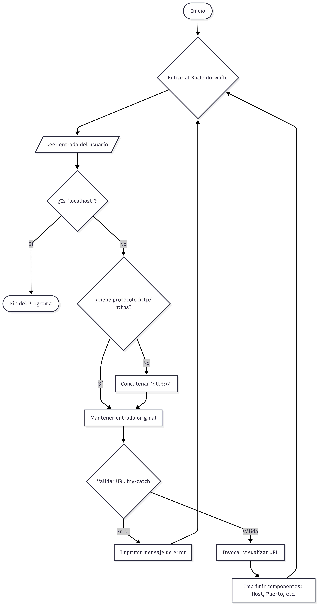

# Componentes de URL

Una aplicación de consola en Java diseñada para diseccionar y 
visualizar los componentes estructurales (protocolo, host, puerto, ruta, etc.) 
de una dirección web introducida por el usuario.

# Diagrama de Flujo
Este diagrama ilustra cómo el programa procesa la entrada 
del usuario desde el inicio hasta el cierre.



# Análisis del Código (Cómo funciona)

## Desglosamos la lógica interna dividida por bloques funcionales.

### 1. Bucle Principal y Entrada de Datos

El núcleo del programa reside en un bucle do-while. Esto garantiza que el código se ejecute al menos una vez y
continúe solicitando datos hasta que el usuario decida salir.

````java
do {
    System.out.println("Ingresa una direcion solo introduce la dirección www. ");
    host = teclado.nextLine();
    
    // Condición de salida inmediata
    if (host.equals("localhost")) {
        System.out.println("Programa finalizado.");
        break;
    }
    // ...
} while (!host.equals("localhost"));
````
Por qué funciona: Usamos break para una salida forzada y limpia si la palabra clave es "localhost", evitando procesar 
esa cadena como una URL web.

### 2. Normalización de la Cadena (Sanitización)

La clase URL de Java es estricta; requiere un protocolo (http o https) para considerar una dirección válida. Como los usuarios suelen escribir solo "www.google.com",
debemos inyectar el protocolo si falta.

````java
if (!host.startsWith("http://") && !host.startsWith("https://")) {
    host = "http://" + host;
}
````
Lógica: Si la cadena NO empieza por http Y NO empieza por https, asumimos que es una dirección web estándar y le anteponemos http://.

### 3. Manejo de Excepciones y Creación del Objeto

Aquí es donde ocurre la "magia" de la conversión de texto a objeto funcional.
````java
try {
    URL url = new URL(host); // Intenta crear el objeto
    visualizar(url);         // Si tiene éxito, lo muestra
} catch (MalformedURLException e) {
    System.out.println("Error: El host no es valido");
}
````
Control de errores: El bloque try-catch es vital. Si el usuario escribe algo sin sentido (ej: "htp:::/mal"), el constructor new URL() lanzará una MalformedURLException. Capturarla evita que el programa se rompa (crash) y permite al usuario intentarlo de nuevo.

### 4. Método Auxiliar de Visualización

Para mantener el main limpio, delegamos la impresión de datos a un método estático privado.

````java
private static void visualizar(URL url) {
    System.out.println("URL completa: " + url.toString());
    System.out.println("Host: " + url.getHost());     // Ej: www.google.com
    System.out.println("Port: " + url.getPort());     // Ej: -1 (si es por defecto)
    System.out.println("Protocol: " + url.getProtocol()); // Ej: http
    // ...
}
````
