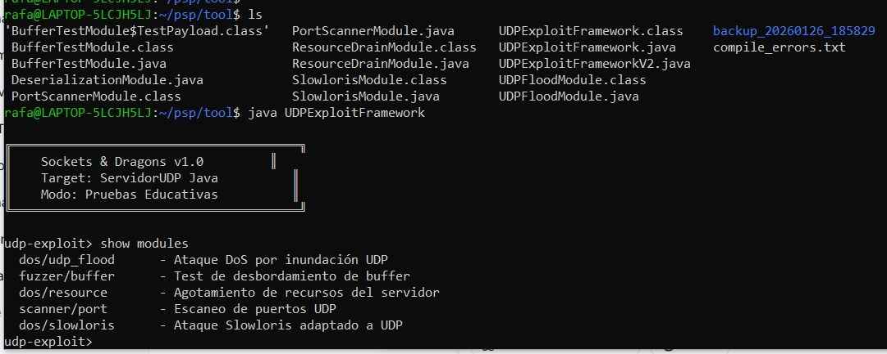

# Cliente – Servidor UDP (Simulación de pérdida de paquetes)

Este proyecto implementa una comunicación **Cliente–Servidor usando UDP en Java**, incorporando una simulación de pérdida de paquetes para entender el comportamiento real de este protocolo.

La práctica permite observar cómo **UDP no garantiza la entrega de mensajes**, a diferencia de TCP.

---

## Objetivo del proyecto

- Comprender el funcionamiento del protocolo UDP
- Practicar el uso de `DatagramSocket` y `DatagramPacket`
- Simular un entorno real de red con pérdida de paquetes
- Diferenciar claramente UDP frente a TCP
- Trabajar comunicación cliente–servidor sin conexión persistente

---

## Conceptos trabajados

- Protocolo UDP
- Cliente–Servidor
- Envío y recepción de datagramas
- Conversión de bytes a texto
- Uso de `Math.random()` para simulaciones
- Control de flujo con bucles
- Comunicación sin conexión (connectionless)

---

## Estructura del proyecto

📁 src
├── ServidorUDP.java
└── ClienteUDP.java

- **ServidorUDP**  
  Recibe mensajes, simula pérdida de paquetes y responde en mayúsculas.

- **ClienteUDP**  
  Envía mensajes al servidor y espera la respuesta.

---

## Cómo ejecutar el proyecto

> ###  Ejecutar Primero el servidor
1. Abrir el proyecto en el IDE
2. Ejecutar la clase `ServidorUDP`
3. El servidor queda a la espera de mensajes

> ### Después Ejecutar el cliente
1. Ejecutar la clase `ClienteUDP`
2. Introducir mensajes por consola
3. Observar si llega o no respuesta del servidor

> ⚠️ Algunas veces el cliente **no recibirá respuesta**, ya que el servidor simula pérdida de paquetes.

---

## Funcionamiento de la simulación de caos

El servidor incluye una zona de simulación donde:

- Existe un **30% de probabilidad** de que el servidor no responda
- El mensaje se recibe, pero se descarta intencionadamente
- Se imita el comportamiento real de redes UDP

Esto demuestra que:
- UDP **no garantiza entrega**
- UDP **no reintenta**
- UDP **no mantiene conexión**

---

##  Esquema de comunicación


## Caso de Uso


---

## Comprobando la seguridad

### 1. Pruebas de Fuzzing y Buffer Overflow
bash
#### A. Probar diferentes tamaños de paquetes
````for size in 64 128 256 512 1024 2048 4096 8192 16384; do
    echo "Probando tamaño: $size bytes"
    sudo hping3 -2 -p 9876 --data $size -c 1 127.0.0.1
    sleep 0.5
done
````
#### B. Paquetes extremadamente grandes
````
sudo hping3 -2 -p 9876 --data 65507 -c 1 127.0.0.1  # Máximo tamaño UDP
````
#### C. Paquetes fragmentados
````
sudo hping3 -2 -p 9876 --data 3000 --frag -c 1 127.0.0.1
````
### 2. Pruebas de Inyección de Datos

### A. Caracteres especiales y de control
````bash
sudo hping3 -2 -p 9876 -d 10 -e $'\\x00\\x01\\x02\\x03' 127.0.0.1  # Binario
sudo hping3 -2 -p 9876 -d 10 -e $'\\xff\\xff\\xff\\xff' 127.0.0.1  # Valores máximos
````
### B. Secuencias de escape y newlines
````
sudo hping3 -2 -p 9876 -d 20 -e $'\\n\\r\\n\\rTEST\\n\\r' 127.0.0.1
````
### C. Path traversal y comandos
````
sudo hping3 -2 -p 9876 -d 50 -e "../../../../etc/passwd" 127.0.0.1
sudo hping3 -2 -p 9876 -d 50 -e "; ls -la; echo INYECTADO" 127.0.0.1
````
### D. SQL Injection
````
sudo hping3 -2 -p 9876 -d 30 -e "' OR '1'='1" 127.0.0.1
sudo hping3 -2 -p 9876 -d 40 -e "'; DROP TABLE users; --" 127.0.0.1
````
## 3. Pruebas de DoS/Stress
bash
### A. Flood controlado (10 segundos)
````
sudo timeout 10s hping3 -2 -p 9876 --fast 127.0.0.1
````
### B. Con datos grandes
````
sudo timeout 5s hping3 -2 -p 9876 --data 1024 --fast 127.0.0.1
````
### C. Multi-thread (usando xargs para paralelismo)
````
seq 1 100 | xargs -P 10 -I {} sudo hping3 -2 -p 9876 -d 100 -c 10 127.0.0.1
````





##  Tecnologías utilizadas

- Java
- UDP (`DatagramSocket`, `DatagramPacket`)
- IDE: IntelliJ IDEA / Eclipse
- JDK 17 (o compatible)

---

## Contexto académico

Práctica desarrollada dentro del **Grado Superior en Desarrollo de Aplicaciones Multiplataforma (DAM)** para la asignatura de **Programación / Servicios en Red**, con fines formativos.

---

## Autores

- **Daniel Alcaparra**

- **Alvaro Caler**

- **Bernardo Cubero** 

- **German Gutierrez**

- **Pablo Herrador**
- **Rafael Moreno**

Estudiantes de Desarrollo de Aplicaciones Multiplataforma (DAM)

---


