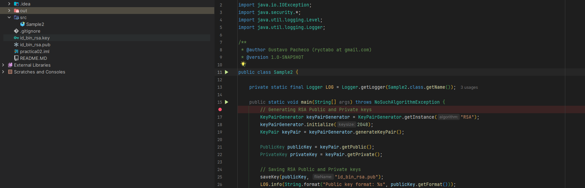

# Generador de Llaves RSA en Java
Esta basado en el ejemplo de [Gustavo Pacheco](https://ryctabo.wordpress.com/2018/02/04/generating-public-and-private-keys-in-java/)
Este proyecto nos enseña a utilizar el Algoritmo RSA, para las aplicaciones que necesitan cifrado asimétrico firmas digitales o comunicación segura.
## ¿Qué hace este código?
El programa utiliza la biblioteca de seguridad estándar de Java (java.security) para realizar tres tareas principales:

 - Inicialización del Algoritmo: Configura un motor de generación para el algoritmo RSA.

 - Generación de Par de Llaves: Crea un objeto KeyPair que contiene tanto la llave pública como la privada con un tamaño específico (por ejemplo, 1024 o 2048 bits).

 - Exportación a Archivos: Convierte las llaves generadas a un formato legible (Base64) y las guarda en archivos físicos con encabezados estándar (BEGIN RSA PUBLIC KEY, etc.).

## Componentes Clave

 - KeyPairGenerator: La clase principal que se encarga de crear las llaves basándose en el algoritmo solicitado.

 - RSA (Rivest-Shamir-Adleman): El algoritmo de cifrado asimétrico utilizado, basado en la factorización de números primos grandes.

 - Base64 Encoding: Se utiliza para transformar los bytes binarios de las llaves en texto plano, facilitando su almacenamiento en archivos .key o .pub.

## Cómo funciona (Resumen del Código)

```java
// 1. Obtener la instancia para RSA
KeyPairGenerator kpg = KeyPairGenerator.getInstance("RSA");

// 2. Definir el tamaño de la llave (Seguridad)
kpg.initialize(2048);

// 3. Generar el par
KeyPair kp = kpg.generateKeyPair();
PublicKey publicKey = kp.getPublic();
PrivateKey privateKey = kp.getPrivate();

// 4. Guardar en disco (usando Base64)
// [Código para escribir en archivos .txt o .key]


```
Notas de Seguridad

 - Llave Privada: Nunca debe ser compartida. Se usa para descifrar mensajes o firmar documentos.

 - Llave Pública: Se puede distribuir libremente. Se usa para cifrar mensajes destinados al dueño de la llave o para verificar su firma.

 - Tamaño: Actualmente se recomienda un tamaño de al menos 2048 bits para aplicaciones modernas de producción.

Ademas al generar los código de forma local nos genera un archivo con nuestra clave pública y privada




### Realizado por Bernardo Cubero Clase de Procesos y Servicios